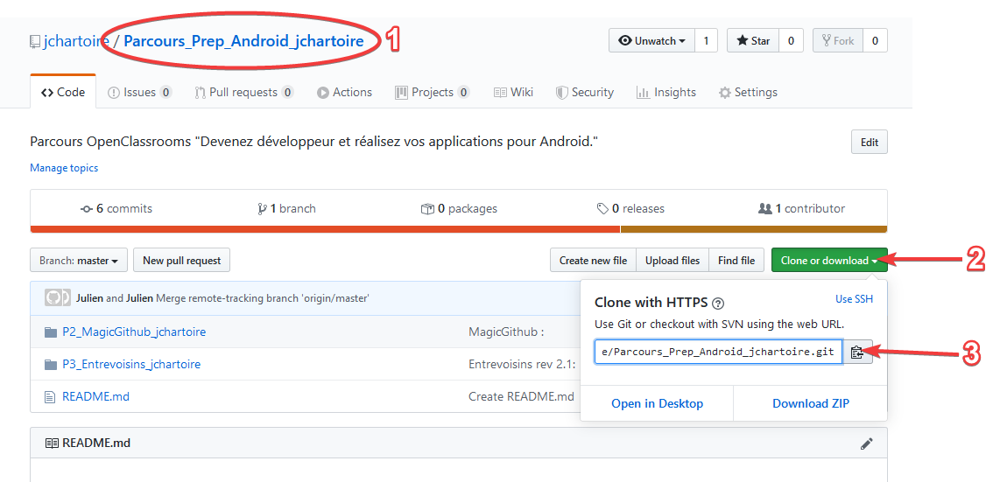
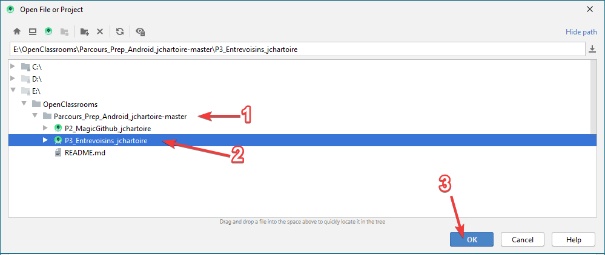
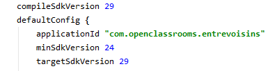
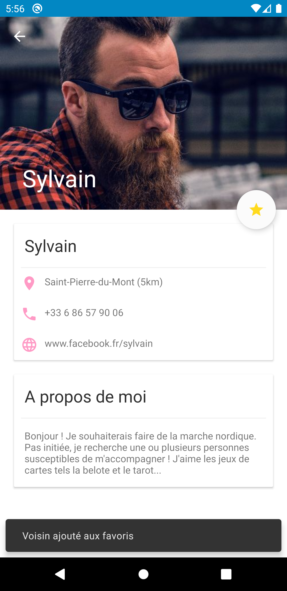

# OpenClassrooms
## P3 - Application Entrevoisins

> "Développez une nouvelle fonctionnalité pour l'application
> Entrevoisins et testez-la"

La source de ce projet développé par [Deyine Jiddou](https://github.com/Deyine) est disponnible sur GitHub à l'adresse :
https://github.com/Deyine/OpenClassrooms/tree/master/Android/Entrevoisins

Analyse de l’existant :

> * Lister mes voisins
> * Ajouter un voisin
> * Suppression d'un voisin

Cadrage des fonctionnalités à ajouter :
[Note de cadrage](https://s3-eu-west-1.amazonaws.com/course.oc-static.com/projects/GEN+android+P3/De%CC%81veloppez+une+nouvelle+fonctionnalite%CC%81+pour+l%E2%80%99application+Entrevoisins-+Note+de+cadrage+(1).pdf)

> Au clic sur un utilisateur, nouvel écran avec :
> * Un bouton de retour à l'élément précédent ;
> * L'avatar de l'utilisateur ;
> * Le nom de l'utilisateur ;
> * Un bouton d'ajout du voisin à la liste de favoris
> * Un onglet Favoris dans lequel les utilisateurs marqués comme favoris s'affichent.

## Installation
* Pour reprendre ma version du projet, rendez vous à la racine du dépôt qui contient tous mes projets du parcours "Prep' Android" d'OpenClassrooms, à cette adresse :
  https://github.com/jchartoire/Parcours_Prep_Android_jchartoire
* Si vous souhaitez contribuer à mon propre projet, clonez le dépôt en copiant l'[URL HTTPS .git](https://github.com/jchartoire/Parcours_Prep_Android_jchartoire.git) , sinon téléchargez l'ensemble du [projet compressé en .zip](https://github.com/jchartoire/Parcours_Prep_Android_jchartoire/archive/master.zip)

* Dans Android Studio, ouvrez le projet depuis l'arborescence `Parcours_Prep_Android_jchartoire-master\P3_Entrevoisins_jchartoire`

* Une fois le projet synchronisé et compilé, mettez à jour le plugin Android Gradle si nécessaire.
* Il est conseillé d'avoir installé au minimum la version API 29 du SDK ; Le projet étant actuellement configuré avec la version 29.

* Vous pouvez exécuter l'application, ainsi que ses tests, sur la machine virtuel de votre choix.

