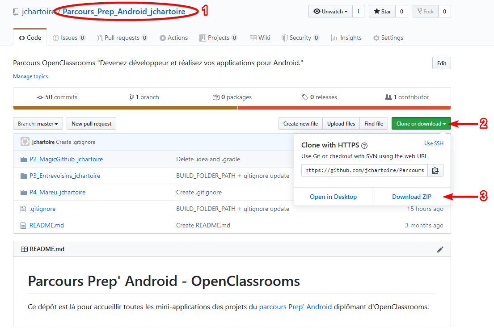
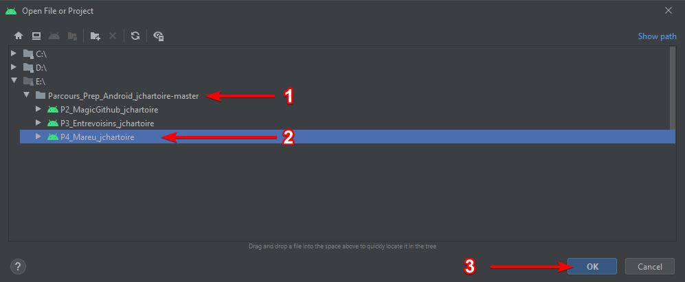

# OpenClassrooms
## P4 - Application Maréu

> "Développez une application de gestion des réunions en entreprise"

Cadrage des fonctionnalités à développer :
[Note de cadrage](https://s3-eu-west-1.amazonaws.com/course.oc-static.com/projects/GEN+android+P4/Note+de+cadrage+-+Mare%CC%81u.pdf)

> * Liste des réunions comprenant :
>   * l'heure de la réunion
>   * le lieu de la réunion
>   *  le sujet de la réunion
>   * la liste des participants (adresses mail)
> * Ajout d'une réunion
> * Suppression d'une réunion
> * Filtre des réunions par date ou par lieu.
> * Gestion de l'affichage responsive sur toutes les tailles de téléphone et de tablette
>   Android, en modes portrait et paysage.
> * Application supportant Android 3.0 (API21) et ses versions supérieures.

## Installation
* Pour reprendre ma version du projet, rendez vous à la racine du dépôt qui contient tous mes projets du parcours "Prep' Android" d'OpenClassrooms, à cette adresse :
  https://github.com/jchartoire/Parcours_Prep_Android_jchartoire
  
* Si vous souhaitez contribuer à mon propre projet, clonez le dépôt en copiant l' , sinon téléchargez l'ensemble du [projet compressé en .zip](https://github.com/jchartoire/Parcours_Prep_Android_jchartoire/archive/master.zip)

  

    
  

* Dans Android Studio, ouvrez le projet depuis l'arborescence `Parcours_Prep_Android_jchartoire-master\P4_Mareu_jchartoire`

  

    
  

* Vous pouvez exécuter l'application, ainsi que ses tests, sur la machine virtuelle de votre choix.

  
  

