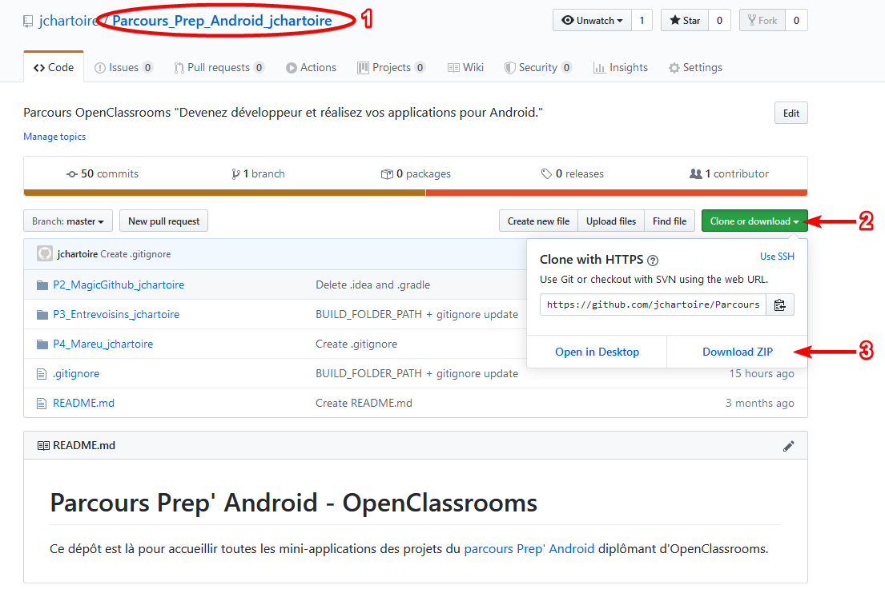
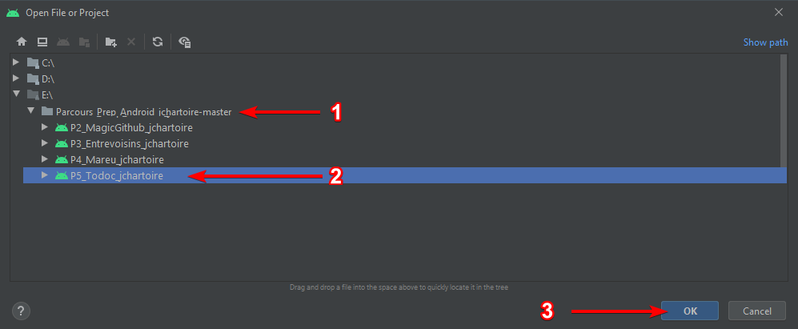
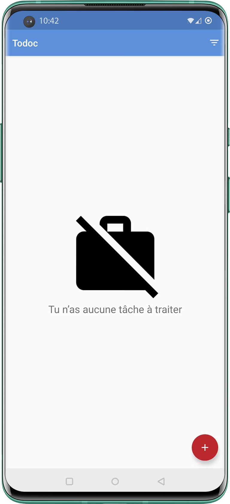

# OpenClassrooms
## P5 - Application Todoc

> "Une application de gestion des tâches"

Fonctionnalités existantes:

> * Lister les tâches pour chacun des projets en cours :
>   * on doit pouvoir reconnaître à quel projet appartient une tâche,
>   
>     grâce à une couleur unique qui sera attribuée manuellement à chaque projet.
>   
>   * si aucune tâche n’est présente, une illustration et un message (“Tu n’as aucune tâche à traiter”) doivent apparaître à l’écran.
>   
> * Ajouter une tâche à réaliser. Celle-ci devra être assignée à un projet au moment de sa création. Pour le moment, seulement 3 projets sont gérés : “Projet Tartampion”, “Projet Lucidia” et “Projet Circus”.
>
> * Supprimer une tâche à réaliser.
>
> * Trier les tâches, par nom de projet OU par date de création.

Mission à réaliser : Gérer la persistance des données de l’application.
[Note de cadrage](https://s3-eu-west-1.amazonaws.com/course.oc-static.com/projects/P5+-+GEN+android/Projet+5+-+De%CC%81livrez+une+application+mobile+en+production+-+Note+de+cadrage+(2).pdf)

> * Implémentation d’une base de données SQLite. Objectif : sauvegarde de la liste des tâches facilitée et structurée.
> * Réalisation d’un modèle relationnel.
> * Réalisation d’un diagramme de classes. Objectif : mettre en avant les différentes classes utilisées dans l’application et les relations entre elles.
> * Réalisation d’un diagramme d’utilisation. Objectif : mieux visualiser le comportement fonctionnel de l’application.
> * Déploiement de l’application sur le Play Store en mode “bêta”, avec création d’une version “release” et “signée”, en générant l’APK correspondant.
> * Code l’application obfusqué en version “release”, afin de protéger encore un peu plus le code source de ce projet.
> * Mise à jour des tests, afin d’intégrer SQLite à l’application.
> * Langage : Java

## Installation
* Pour reprendre ma version du projet, rendez vous à la racine du dépôt qui contient tous mes projets du parcours "Prep' Android" d'OpenClassrooms, à cette adresse :
  https://github.com/jchartoire/Parcours_Prep_Android_jchartoire
  
* Si vous souhaitez contribuer à mon propre projet, clonez le dépôt en copiant l' , sinon téléchargez l'ensemble du [projet compressé en .zip](https://github.com/jchartoire/Parcours_Prep_Android_jchartoire/archive/master.zip)

  

    
  

* Dans Android Studio, ouvrez le projet depuis l'arborescence `Parcours_Prep_Android_jchartoire-master\P5_Todoc_jchartoire`

  

    
  

* Vous pouvez exécuter l'application, ainsi que ses tests, sur la machine virtuelle de votre choix.

 	
	
	

